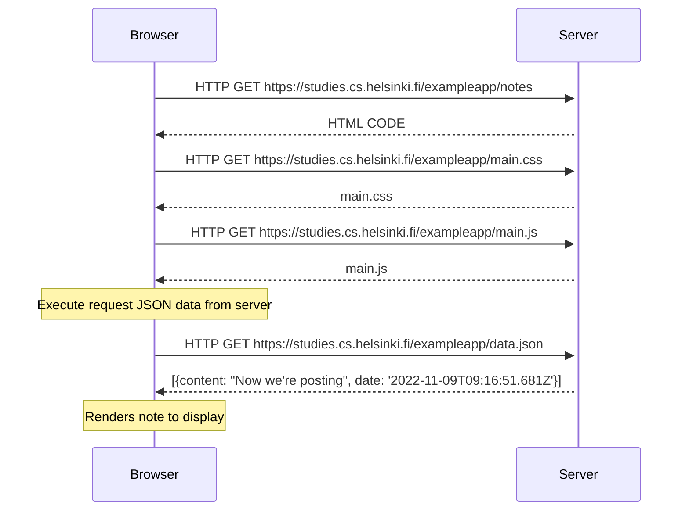

```mermaid
sequenceDiagram
    Browser->>+Server: HTTP GET https://studies.cs.helsinki.fi/exampleapp/notes
    Server-->>Browser: HTML CODE
    Browser->>+Server: HTTP GET https://studies.cs.helsinki.fi/exampleapp/main.css
    Server-->>Browser: main.css
    Browser->>+Server: HTTP GET https://studies.cs.helsinki.fi/exampleapp/main.js
    Server-->>Browser: main.js
    Note over Browser: Execute request JSON data from server
    Browser->>+Server: HTTP GET https://studies.cs.helsinki.fi/exampleapp/data.json
    Server-->>Browser: [{content:  "Now we're posting", date: '2022-11-09T09:16:51.681Z'}]
    Note over Browser: Renders note to display
```
