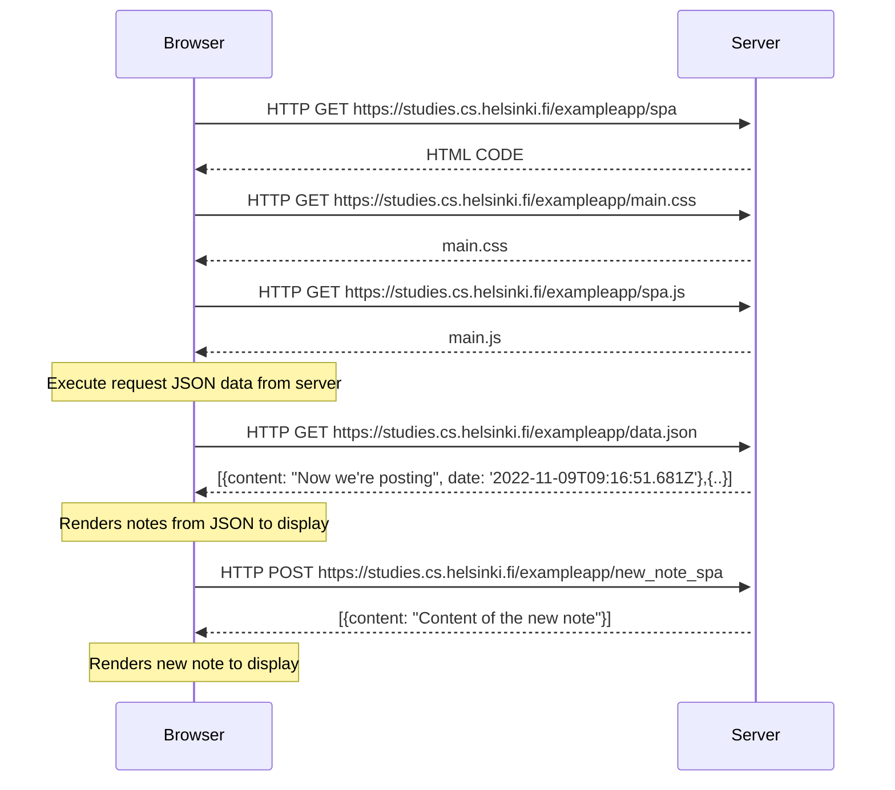

```mermaid
sequenceDiagram
    Browser->>+Server: HTTP GET https://studies.cs.helsinki.fi/exampleapp/spa
    Server-->>Browser: HTML CODE
    Browser->>+Server: HTTP GET https://studies.cs.helsinki.fi/exampleapp/main.css
    Server-->>Browser: main.css
    Browser->>+Server: HTTP GET https://studies.cs.helsinki.fi/exampleapp/spa.js
    Server-->>Browser: main.js
    Note over Browser: Execute request JSON data from server
    Browser->>+Server: HTTP GET https://studies.cs.helsinki.fi/exampleapp/data.json
    Server-->>Browser: [{content:  "Now we're posting", date: '2022-11-09T09:16:51.681Z'},{..}]
    Note over Browser: Renders notes from JSON to display
    Browser->>+Server: HTTP POST https://studies.cs.helsinki.fi/exampleapp/new_note_spa
    Server-->>Browser: [{content:  "Content of the new note"}]
    Note over Browser: Renders new note to display
```
